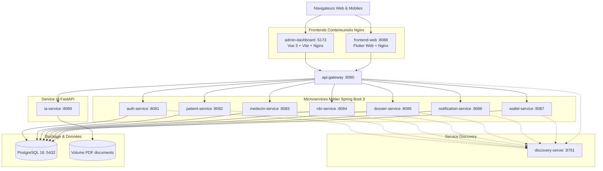

# Plateforme Médicale Diam-Yaraam - Backend Microservices

Architecture microservices distribuée pour la plateforme de santé et de télémédecine **Diam-Yaraam** au Sénégal. Le système interconnecte 10 microservices résilients orchestrés via Spring Cloud (Eureka + API Gateway) et une IA d'orientation clinique basée sur FastAPI et Python.

---

## 🏗️ Architecture des Microservices

| Service | Port | Technologie | Description |
| :--- | :--- | :--- | :--- |
| **Discovery Server** | `8761` | Spring Cloud Netflix Eureka | Enregistrement et découverte automatique des instances |
| **API Gateway** | `8090` | Spring Cloud Gateway | Point d'entrée unique, routage dynamique, filtre JWT & CORS |
| **Shared Library** | N/A | Maven Module | DTOs communs, énumérations métier, exceptions partagées |
| **Auth Service** | `8081` | Spring Boot 3, Spring Security 6, JWT | Gestion des comptes, rôles, sessions, OTP et WhatsApp API |
| **Patient Service** | `8082` | Spring Boot 3, Spring Data JPA | Fiche patient, Pass Vital d'urgence, QR code sécurisé, famille |
| **Medecin Service** | `8083` | Spring Boot 3, Spring Data JPA | Annuaire des praticiens, ordre ONDMS, disponibilités & créneaux |
| **RDV Service** | `8084` | Spring Boot 3, WebSocket STOMP, LiveKit | Planification des consultations, flux vidéo LiveKit WebRTC |
| **Dossier Service** | `8085` | Spring Boot 3, Spring Data JPA | Dossier médical partagé, allergies, antécédents, ordonnances |
| **Notification Service** | `8086` | Spring Boot 3, JavaMail, Firebase FCM | Notifications push mobiles, courriels de confirmation et rappels |
| **Wallet Service** | `8087` | Spring Boot 3, Spring Data JPA | Portefeuille santé en FCFA, recharges Wave / OM, paiements |
| **IA Service** | `8089` | FastAPI, Python 3, OpenRouter, RAG | Triage clinique, vérification pharmacologique Dorosz |
| **Admin Dashboard** | `5173` | Vue 3, Vite, TypeScript, Nginx | Portail d'administration complet, gestion utilisateurs, finances |
| **Frontend Web** | `8088` | Flutter Web, Dart, Nginx | Application patient & praticien, téléconsultation, Pass Vital |

---

## 🐳 Conteneurisation & Déploiement Docker (Recommandé)

L'ensemble de l'architecture backend, de la base de données PostgreSQL, d'Eureka, de l'IA, de l'API Gateway et des deux interfaces frontend (Vue.js et Flutter) est entièrement orchestré via **Docker Compose** avec des *multi-stage builds* sécurisés et optimisés.

### Schéma d'Architecture Docker



### 1. Prérequis
- **Docker Engine** : Version 24+ ou Docker Desktop
- **Docker Compose** : Version v2.20+ (commande `docker compose`)

### 2. Configuration de l'Environnement
Copiez le modèle de configuration et ajustez les variables si nécessaire :
```bash
cp .env.example .env
```
> [!NOTE]
> Le fichier `.env` est ignoré par Git pour des raisons de sécurité. Ne committez jamais vos secrets réels.

### 3. Commandes d'Exploitation Docker

- **Démarrer l'ensemble de la plateforme en arrière-plan :**
  ```bash
  docker compose up --build -d
  ```

- **Vérifier l'état de santé de tous les conteneurs :**
  ```bash
  docker compose ps
  ```

- **Consulter les journaux en direct (streaming) :**
  ```bash
  # Tous les services
  docker compose logs -f

  # Un service spécifique
  docker compose logs -f api-gateway
  docker compose logs -f discovery-server
  docker compose logs -f ia-service
  ```

- **Arrêter la plateforme sans perte de données :**
  ```bash
  docker compose down
  ```

- **Arrêter la plateforme ET supprimer les volumes persistants (remise à zéro PostgreSQL) :**
  ```bash
  docker compose down -v
  ```
  > [!WARNING]
  > La commande `docker compose down -v` supprime définitivement le volume `diam_postgres_data`. Les schémas seront recréés vierges au prochain démarrage.

- **Reconstruire les images Docker à neuf (sans cache) :**
  ```bash
  docker compose build --no-cache
  ```

### 4. Endpoints de Vérification & Santé
- **Dashboard Eureka** : [http://localhost:8761](http://localhost:8761)
- **API Gateway (Health)** : [http://localhost:8090/actuator/health](http://localhost:8090/actuator/health)
- **Service IA (Health)** : [http://localhost:8089/health](http://localhost:8089/health)
- **Microservices Métier** : `http://localhost:<PORT>/actuator/health`

---

## ⚙️ Prérequis & Environnement (Hors Docker / Développement Local)

- **Java JDK** : Version 21 (LTS)
- **Maven** : Version 3.9+ (ou utiliser le wrapper `mvnw.cmd`)
- **Python** : Version 3.10+ (pour `ia-service`)
- **PostgreSQL** : Version 15+ avec base `diam_yaraam`
- **Serveur LiveKit** : Instance WebRTC pour la téléconsultation (port 7880)

---

## 🚀 Démarrage Hors Docker

### 1. Compilation globale
```bash
./mvnw clean compile
```

### 2. Démarrage séquentiel recommandé
1. **Discovery Server** (`discovery-server`) : `mvn spring-boot:run` sur le port 8761
2. **API Gateway** (`api-gateway`) : `mvn spring-boot:run` sur le port 8090
3. **Services Métier** : Démarrer `auth-service`, `patient-service`, `medecin-service`, `rdv-service`, `dossier-service`, `notification-service`, `wallet-service`
4. **Service IA** (`ia-service`) : Exécuter `start_ia_service.bat`

---

## 🌿 Méthodologie Git Flow

Le dépôt applique rigoureusement la méthodologie **Git Flow** :
- `main` : Version stable de production, étiquetée avec des tags sémantiques (`v1.0.0`)
- `develop` : Branche principale d'intégration
- `feature/*` : Branches de fonctionnalités dédiées par microservice ou composant
- `release/*` : Branches de stabilisation et de préparation de livraison
