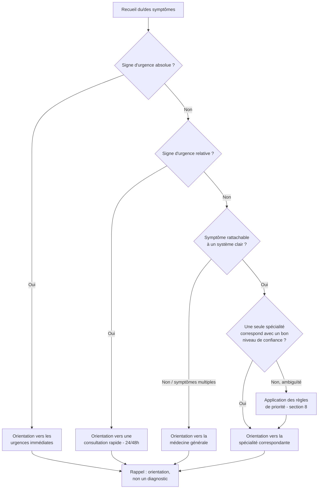

# RÈGLES D'ORIENTATION VERS LA SPÉCIALITÉ MÉDICALE APPROPRIÉE

**Version :** 3.0
**Statut :** Document de référence pour l'orientation des patients

---

## Résumé exécutif

Ce document encadre le processus par lequel un patient est orienté vers une spécialité médicale à partir des symptômes qu'il rapporte. Il repose sur trois principes non négociables :

1. **La détection d'urgence prime toujours sur l'orientation spécialisée.**
2. **L'orientation proposée n'est jamais un diagnostic.**
3. **En cas de doute, la médecine générale ou la prudence (urgence) l'emportent sur une orientation spécialisée trop précise.**

---

## 1. Objectif et champ d'application

Ce document définit les règles selon lesquelles un patient — ou un système d'aide à l'orientation — doit être dirigé vers la spécialité médicale la plus adaptée à sa situation, à partir des symptômes qu'il décrit.

Il s'applique à toute situation où un premier tri est nécessaire avant une prise de rendez-vous, que ce tri soit effectué par un professionnel, un service d'accueil ou un outil automatisé.

Il ne s'applique **pas** à la prise en charge clinique elle-même, qui relève exclusivement du professionnel de santé consulté, ni à la santé mentale, qui relève d'un référentiel dédié.

---

## 2. Définitions

* **Orientation** : proposition d'une spécialité ou d'une filière de soins adaptée au motif de consultation, sans évaluation clinique approfondie.
* **Diagnostic** : identification d'une pathologie par un professionnel de santé, à l'issue d'un examen. L'orientation ne constitue jamais un diagnostic.
* **Urgence absolue** : situation évoquant un risque vital ou fonctionnel immédiat, nécessitant une prise en charge sans délai (ex. : douleur thoracique avec malaise).
* **Urgence relative** : situation ne mettant pas en jeu le pronostic vital immédiat mais nécessitant une prise en charge rapide, sous quelques heures à un jour (ex. : douleur abdominale intense sans autre signe de gravité).
* **Symptôme principal** : motif de consultation le plus marquant ou le plus limitant rapporté par le patient.
* **Niveau de confiance** : degré de certitude avec lequel un symptôme peut être rattaché à une spécialité donnée, sans ambiguïté avec une autre.

---

## 3. Gouvernance et responsabilités

* Ce référentiel est un outil d'aide à l'orientation ; il n'engage pas la responsabilité diagnostique du système ou de la personne qui l'applique.
* Toute orientation issue de ce référentiel reste **révisable** par un professionnel de santé à tout moment du parcours.
* Le document doit faire l'objet d'une **révision périodique** (voir section 12) pour rester conforme aux pratiques cliniques et aux retours d'expérience.
* En cas d'évolution de l'état du patient après une première orientation (aggravation, apparition d'un signe de gravité), la règle d'urgence (section 5) doit être réévaluée immédiatement, indépendamment de l'orientation initiale.

---

## 4. Principe général

L'orientation proposée est **une aide à l'orientation, et non un diagnostic médical**. Elle vise uniquement à diriger le patient vers le professionnel le plus susceptible de traiter son problème, à partir des symptômes rapportés.

Elle ne remplace jamais :

* l'avis d'un professionnel de santé ;
* un examen clinique ;
* un diagnostic médical établi.

Cette réserve doit être communiquée au patient à chaque orientation proposée.

En cas de symptômes vagues, non spécifiques, ou concernant plusieurs systèmes à la fois, l'orientation par défaut est la **médecine générale**, qui assure ensuite, si nécessaire, une réorientation vers un spécialiste.

---

## 5. Règle prioritaire absolue : détection des situations d'urgence

**Avant toute orientation vers une spécialité, le système évalue systématiquement la présence de signes de gravité ou d'urgence.**

Si un signe d'urgence **absolue** est identifié, l'orientation vers une spécialité est **interrompue** et remplacée par une orientation vers les **urgences immédiates** (urgences hospitalières, numéro d'urgence local). Cette règle prévaut sur toute autre logique du présent document.

Si un signe d'urgence **relative** est identifié, le patient est orienté vers une **consultation rapide** (le jour même ou sous 24 à 48 heures), en médecine générale ou dans la spécialité concernée selon la disponibilité, plutôt que vers un rendez-vous standard.

### 5.1 Signes d'urgence par spécialité

| Spécialité | Signes d'urgence absolue | Signes d'urgence relative |
|---|---|---|
| Cardiologie | Douleur thoracique intense/oppressante avec irradiation bras/mâchoire/dos, malaise associé | Palpitations prolongées et mal tolérées, gonflement soudain des jambes avec essoufflement |
| Pneumologie | Détresse respiratoire brutale, impossibilité de parler par manque de souffle, coloration bleutée des lèvres | Aggravation rapide d'un essoufflement connu, toux avec crachats sanglants |
| Neurologie | Faiblesse/paralysie brutale d'un côté du corps, trouble soudain de la parole, perte de connaissance, convulsions, "pire mal de tête de la vie" | Maux de tête inhabituels et croissants, trouble de l'équilibre d'apparition récente |
| Gastro-entérologie | Douleur abdominale brutale et intense, vomissements de sang, saignement digestif important | Douleur abdominale intense persistante sans autre signe de gravité, vomissements répétés empêchant l'hydratation |
| Ophtalmologie | Perte brutale de la vision, traumatisme oculaire sévère | Douleur oculaire intense avec baisse de vision progressive |
| ORL | Difficulté à respirer ou à avaler d'apparition brutale, saignement de nez incontrôlable | Douleur d'oreille intense avec fièvre élevée, vertiges invalidants |
| Gynécologie / obstétrique | Saignement abondant, douleur pelvienne brutale et intense, grossesse avec douleur ou saignement | Douleurs pelviennes intenses persistantes, fièvre associée à des pertes anormales |
| Urologie | Impossibilité totale d'uriner, douleur testiculaire brutale et intense | Sang abondant dans les urines, douleur rénale intense avec fièvre |
| Dermatologie | Éruption cutanée étendue avec fièvre et altération de l'état général (suspicion de réaction grave) | Infection cutanée avec extension rapide, fièvre |
| Odontologie | Gonflement du visage ou du cou avec difficulté à avaler/respirer (suspicion de cellulite dentaire) | Douleur dentaire intense avec fièvre |
| Pédiatrie | Fièvre élevée chez un nourrisson de moins de 3 mois, détresse respiratoire, léthargie inhabituelle, convulsions | Fièvre persistante mal tolérée, vomissements/diarrhée avec signes de déshydratation |
| Général | Saignement incontrôlable, traumatisme sévère, altération brutale de l'état de conscience | Fièvre élevée persistante sans point d'appel, altération progressive de l'état général |

Cette liste est indicative et non exhaustive : toute combinaison de symptômes évoquant une menace vitale ou fonctionnelle doit primer sur la logique d'orientation spécialisée classique. **En cas de doute sur le caractère urgent d'une situation, le système privilégie systématiquement la prudence** et oriente vers le niveau d'urgence le plus élevé compatible avec les symptômes décrits.

---

## 6. Algorithme de décision

### 6.1 Étapes détaillées

1. **Recueillir le ou les symptômes principaux** décrits par le patient, ainsi que leur intensité, leur durée et leur évolution.
2. **Évaluer la présence d'un signe d'urgence absolue** (section 5.1). Si présent → urgences immédiates, fin du processus.
3. **Évaluer la présence d'un signe d'urgence relative**. Si présent → consultation rapide, fin du processus.
4. **Identifier le système ou l'organe concerné** par le symptôme principal.
5. **Évaluer le niveau de confiance** de la correspondance symptôme-spécialité (section 7).
6. **Faire correspondre ce système à la spécialité adaptée** (section 7) si le niveau de confiance est suffisant.
7. **En cas de symptômes multiples touchant plusieurs systèmes**, ou trop généraux pour être rattachés clairement à une spécialité → médecine générale.
8. **En cas de correspondance possible avec plusieurs spécialités** → appliquer les règles de priorité (section 8).
9. **Rappeler systématiquement** au patient que l'orientation est indicative et ne constitue pas un diagnostic.

---

## 7. Tableau détaillé d'orientation par spécialité

| Spécialité | Domaine de compétence | Symptômes déclencheurs typiques | Niveau de confiance requis |
|---|---|---|---|
| Cardiologie | Cœur, système cardiovasculaire | Douleur/gêne thoracique non aiguë, palpitations, hypertension artérielle, essoufflement à l'effort, gonflement des jambes | Élevé si symptôme cardiaque isolé |
| Dermatologie | Peau, cheveux, ongles, muqueuses | Boutons persistants, rougeurs, démangeaisons, plaques, éruption cutanée, grain de beauté suspect | Élevé, symptôme visible et localisé |
| Pneumologie | Poumons, voies respiratoires | Toux persistante, essoufflement chronique, respiration sifflante, troubles du sommeil respiratoires | Élevé si pas de douleur thoracique associée |
| Gastro-entérologie | Œsophage, estomac, intestin, foie, vésicule, pancréas | Douleurs abdominales persistantes, diarrhée/constipation prolongée, brûlures d'estomac, ballonnements | Modéré, chevauchement possible avec urologie/gynécologie |
| Neurologie | Cerveau, moelle épinière, nerfs | Maux de tête persistants ou inhabituels, troubles de la sensibilité, tremblements, troubles de l'équilibre | Modéré, chevauchement possible avec ORL |
| Gynécologie | Appareil reproducteur féminin | Troubles des règles, douleurs pelviennes, pertes anormales, douleurs pendant les rapports | Élevé |
| Pédiatrie | Santé de l'enfant | Fièvre, toux persistante, troubles digestifs, troubles de croissance ou du comportement chez l'enfant | Prioritaire dès lors que le patient est un enfant |
| Odontologie | Dents, gencives, bouche | Douleur dentaire, dent cassée, saignement des gencives, douleur à la mastication | Élevé |
| Ophtalmologie | Yeux, vision | Vision floue, baisse de vision, douleur ou rougeur oculaire persistante | Élevé |
| ORL | Oreille, nez, gorge | Douleur d'oreille, baisse d'audition, nez bouché persistant, mal de gorge répété, vertiges | Modéré, chevauchement possible avec neurologie (vertiges) |
| Urologie | Appareil urinaire, appareil reproducteur masculin | Troubles urinaires, sang dans les urines, douleurs rénales, troubles de la prostate | Élevé |
| Médecine générale | Premier recours, tous motifs | Symptômes non spécifiques, fièvre isolée, fatigue, motif peu clair, suivi général | Par défaut si confiance faible ailleurs |

---

## 8. Gestion des cas ambigus et priorités entre spécialités

Lorsqu'un symptôme peut relever de plusieurs spécialités, les règles suivantes s'appliquent, **dans l'ordre** :

1. **Priorité à l'urgence** : toute ambiguïté est résolue en faveur du niveau d'urgence le plus élevé compatible avec les symptômes.
2. **Priorité à l'âge du patient** : chez l'enfant, la pédiatrie est privilégiée par défaut, même pour un symptôme qui orienterait un adulte vers une autre spécialité (ex. : toux persistante chez l'enfant → pédiatrie, pas pneumologie).
3. **Priorité au symptôme dominant** : le symptôme le plus marquant ou le plus limitant détermine la spécialité, plutôt qu'un symptôme secondaire.
4. **Priorité à la spécialité organique directe** : un symptôme rattaché sans ambiguïté à un organe (ex. : douleur dentaire → odontologie) prévaut sur une interprétation plus générale.
5. **Priorité au niveau de confiance le plus élevé** (section 7) entre les spécialités candidates.
6. **En cas d'égalité ou d'ambiguïté persistante** entre deux spécialités proches (ex. : vertiges pouvant relever de l'ORL ou de la neurologie) → orientation vers la médecine générale, qui réoriente ensuite.
7. **En l'absence de règle applicable** → médecine générale par défaut.

---

## 9. Cas particuliers

* **Enfant** : orientation par défaut vers la pédiatrie pour toute question de santé infantile, sauf urgence auquel cas la règle de la section 5 s'applique en priorité.
* **Grossesse** : toute douleur, saignement ou symptôme inhabituel chez une femme enceinte est traité selon la règle d'urgence (section 5) avant toute autre orientation.
* **Personne âgée ou polypathologique** : en cas de doute, privilégier une orientation prudente (urgence relative ou médecine générale) compte tenu du risque accru de complications ou de présentations atypiques.
* **Symptômes chroniques déjà suivis** : si le patient est déjà suivi par un spécialiste pour le motif concerné, orienter en priorité vers ce suivi existant plutôt que vers une nouvelle orientation.
* **Demande de suivi général** (bilan, renouvellement d'ordonnance, prévention, vaccination) : médecine générale.
* **Symptômes psychologiques ou de santé mentale** : hors champ de ce référentiel ; orienter selon un référentiel dédié, avec vigilance particulière en cas de signes de crise.

---

## 10. Limites du système

* Le système ne pose pas de diagnostic et ne doit jamais être présenté comme tel au patient.
* Il repose sur les symptômes déclarés par le patient, qui peuvent être incomplets, imprécis ou mal interprétés.
* Il ne remplace pas l'évaluation clinique d'un professionnel de santé, qui reste seul habilité à confirmer ou modifier l'orientation proposée.
* En cas d'incertitude sur la gravité d'une situation, la règle de prudence prévaut toujours sur la recherche d'une orientation spécialisée précise.
* Ce référentiel ne couvre pas l'ensemble des situations cliniques possibles ; il constitue un cadre général destiné à être complété par le jugement du professionnel appliquant ces règles.

---

## 11. Suivi qualité et amélioration continue

* **Révision périodique** : ce document doit être revu à intervalle régulier (par exemple annuellement) ou dès qu'un retour d'expérience significatif le justifie.
* **Traçabilité** : lorsque ce référentiel est appliqué par un système automatisé, chaque orientation devrait pouvoir être tracée (symptômes recueillis, règle appliquée, orientation proposée) afin de permettre un audit ultérieur.
* **Retour d'expérience** : toute orientation s'avérant inadaptée a posteriori doit être analysée afin d'ajuster, si nécessaire, les règles correspondantes.

---

## 12. Rappel final

> La spécialité proposée constitue une **orientation, et non un diagnostic**.
> En présence de signes de gravité ou d'urgence, la priorité est **toujours** donnée à une orientation vers une prise en charge urgente, avant toute proposition de rendez-vous spécialisé.
> En cas de doute, la prudence l'emporte systématiquement sur la précision de l'orientation.
